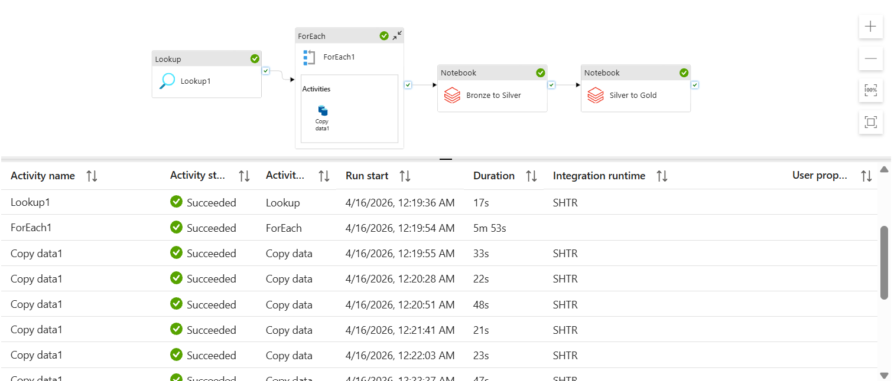

# Azure End-to-End Data Engineering Project Report
## Project Overview
This project focuses on building a complete end-to-end data engineering pipeline using Microsoft Azure services. The main goal is to **extract customer and sales data from an on-premises SQL database, process and transform the data in the cloud, and generate meaningful insights through a Power BI dashboard**.

The final output is a Power BI dashboard that helps users understand important business information such as customer gender distribution and product sales performance. With this system, decision-makers can easily filter data and analyze trends based on date, category, or gender.

## Description on the Solution
The solution is designed as a structured data pipeline on Microsoft Azure, where data flows through several stages from ingestion to visualization. The process begins with extracting customer and sales data from an on-premises SQL database using Azure Data Factory. This service is responsible for securely connecting to the source system and automating the data ingestion process into the cloud.

Then, the extracted data is stored in Azure Data Lake Storage, which acts as the central repository for both raw and processed data. The data is organized into different layers(Bronze and Silver layer), allowing it to be managed and accessed efficiently as it moves through the pipeline.

Data transformation is then carried out using Azure Databricks and Azure Synapse Analytics. In this stage, raw data is cleaned, validated and transformed into structured formats suitable for analysis. This step ensures consistency and improves data quality before it is used for reporting.

The entire pipeline is designed to run automatically on a schedule through Azure Data Factory, minimizing manual intervention. It is also scalable, meaning it can handle increasing volumns of data without requiring major architectual changes.Security is managed through Azure's built-in features such as role-based access control (RBAC) and secure credential storage, ensuring that sensitive data is protected throughout the pipeline.

Finally, the processed data is connected to Microsoft PowerBI, where it is visualizes in an interactive dashboard. Users can explore key insights and visual elements, enabling more informed and data-driven decision-making.

## Technology Used
The project uses a full Azure-based technology stack:
  - **On-Premises SQL Database**: Source of raw customer and sales data
  - **Azure Data Factory**: Data ingestion and pipeline orchestration
  - **Azure Data Lake Storage Gen2**: Data storage (Bronze, Silver and Gold layers)
  - **Azure Databricks**: Data transformation and processing
  - **Azure Synapse Analytics**: Data warehousing and querying
  - **Microsoft Power BI**: Data visualization via dashboard
  - **Azure Entra ID**: Identity and access management
  - **Azure Key Vault**: Secure storage of credentials and secrets
These tools work together to create a scalable and secure data engineeering pipeline. 
## Data Pipeline Architecture
The data pipeline follows a layered medallion architecture, where data is refined from raw input into business-ready outputs. The diagram below shows the full end-to-end flow across all components.

  

**Stage 1: Data Source(On-Premises SQL Database)**

The pipeline starts with an on-premises SQL Server database that stores customer and sales transactions. This acts as the main operational system, where daily business data is generated and maintained before being moved to the cloud.

**Stage 2: Ingestion(Azure Data Factory)**

Azure Data Factory handles data ingestion and overall pipeline orchestration. It connects to the on-premises database and extracts tables dynamically using a ForEach activity, allowing new tables to be included without modifying the pipeline. It also coordinates downstream processes, such as triggering Databricks notebooks, updating Synapse views, and scheduling pipeline runs. The diagram belows shows the data pipeline is created in Azure Data Factory.

  

**Stage 3: Storage & Transformation**

The ingested data is stored in Azure Data Lake Storage Gen 2, organized into three layers:
  - **Bronze Layer**: Stores raw data exactly as it is extracted, serving as a backup of original records.
  - **Silver Layer**: Data is cleaned and transformed using Databricks (PySpark), including tasks like standardizing formats, renaming columns, fixing data types and removing duplicates.
  - **Gold Layer**: Data is further processed into aggregated, business-ready tables optimized for reporting and analysis.

**Stage 4: Serving Layer(Azure Synapse Analytics)**

Azure Synapse Analytics in the Gold layer and provides SQL views for the processed data. This makes the data easier to query and removes the need to interact directly with raw files in the data lake.

**Step 5: Visualization(Power BI)**

Power BI connects to the Synapse views to create an interactive dashboard, allowing users to easily understand business insights and support better decision-making.

**Stage 6: Security & Governance(Azure Active Directory + Azure Key Vault)**

Security and access control are handled across the entire system using Azure Active Directory (Entra ID), which manages authentication between services. Azure Key Vault is used to securely store sensitive information such as connection strings and access keys, ensuring credentials are never hardcoded and are safely retrieved when needed.

## MS Power BI Dashboard
The Power BI dashboard is designed to provide clear and interactive insights into the business data. Click [here](https://github.com/TehRuQian/End2End-ADF/blob/b3e84dd5ab056b967555a7ecaf2319a46ef21f91/ADF%20Project-Dashboard.pbix) to view the dashboard is created for this project.

## Reflection
Even though the video was only about 2.5 hours, it took me almost 3 days to complete it. Along the way, I faced many issues such as account limitations during system setup, missing source files and errors when running and debugging the pipeline. However, these difficulties became the most valuble part of the learning process, as they helped me better understand how to troubleshoot and solve real-world problems. 

By completing this project, I gained a better understanding of how an end-to-end data pipeline works. I was able to see how different Azure services are connected and how data moves from one stage to another, starting from data ingestion, followed by transformation, and finally visualization. I also learned how important it is to properly structure and clean data before using it for analysis.

Overall, this project provided me with hands-on experience in data engineering and showed how powerful cloud-based solutions can be in handling and processing large amounts of data efficiently.

  

